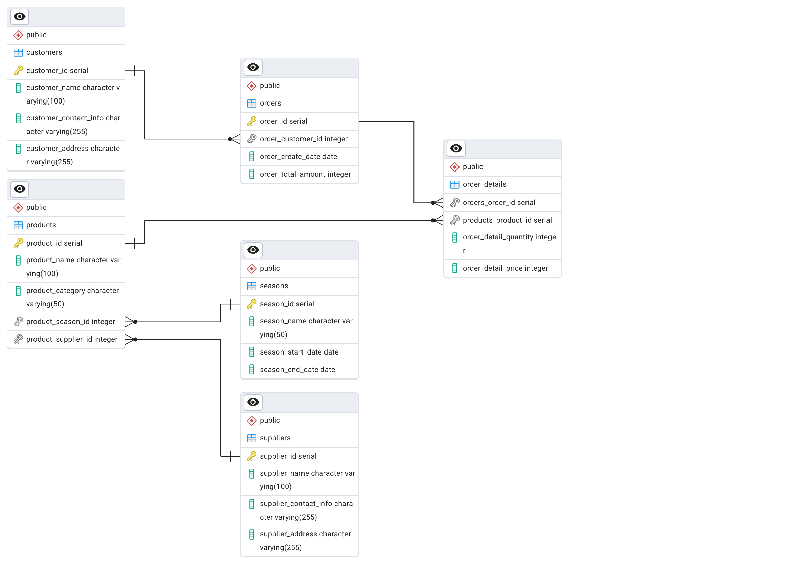
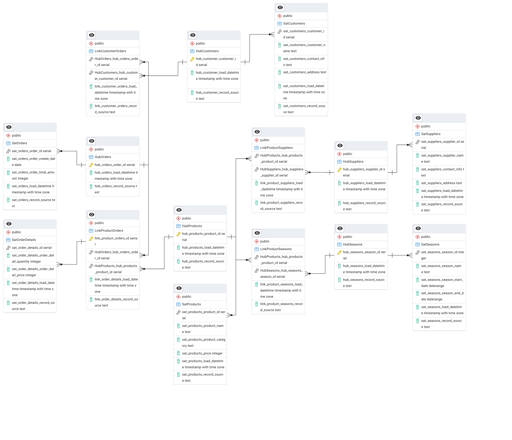

# Л.р. №2 Реализация структуры Data Vault

1. Изучите пример выполнения задания: http://www.dwh-club.com/ru/dwh-bi-articles/vse-o-data-vault.html
2. В СУБД PostgreSQL (или другой реляционной) реализуйте структуру базы данных в соответствии с моделью 3NF. Результат представьте в виде даталогической модели и задокументированного SQL кода создания базы данных.  Каждый берет свой вариант. Файл с вариантами прикреплен к заданию.
3. В СУБД PostgreSQL реализуйте структуру базы данных в соответствии с моделью Data Vault. Результат представьте в виде даталогической модели и задокументированного SQL кода создания базы данных.
4. Обе модели оформите в виде лабораторной работы и прикрепите в lms.

## Задание
> **Вариант 12** Система должна описывать процесс поставки сезонных товаров в оптовой фирме.

## 3NF

1. **Товары (Products)** — информация о сезонных товарах.
   - `product_id` (PK) — уникальный идентификатор товара.
   - `product_name` — название товара.
   - `product_category` — категория товара.
   - `product_season_id` (FK) — внешний ключ на таблицу Seasons (Сезон, к которому относится товар).
   - `product_supplier_id` (FK) — внешний ключ на таблицу Suppliers (Поставщик товара).
2. **Поставщики (Suppliers)** — информация о поставщиках товаров.
   - `supplier_id` (PK) — уникальный идентификатор поставщика.
   - `supplier_name` — название поставщика.
   - `supplier_contact_info` — контактная информация поставщика.
   - `supplier_address` — адрес поставщика.
4. **Сезоны (Seasons)** — информация о сезонах, в которые поставляются товары.
   - `season_id` (PK) — уникальный идентификатор сезона.
   - `season_name` — название сезона (например, Лето, Осень, Зима, Весна).
   - `season_start_date` — дата начала сезона.
   - `season_end_date` — дата окончания сезона.
6. **Клиенты (Customers)** — информация о клиентах фирмы.
   - `customer_id` (PK) — уникальный идентификатор клиента.
   - `customer_name` — имя или название компании клиента.
   - `customer_contact_info` — контактная информация клиента.
   - `customer_address` — адрес клиента.
5. **Заказы (Orders)** — информация о заказах товаров от фирмы на поставку.
   - `order_id` (PK) — уникальный идентификатор заказа.
   - `order_customer_id` (FK) — внешний ключ на таблицу Customers (Клиент, сделавший заказ).
   - `order_create_date` — дата заказа.
   - `order_total_amount` — общая стоимость заказа.
7. **Детали заказа (OrderDetails)(MM)** — информация о товарах, входящих в конкретный заказ.
   - `orders_order_id` (FK) — внешний ключ на таблицу Orders (Заказ).
   - `products_product_id` (FK) — внешний ключ на таблицу Products (Товар).
   - `order_detail_quantity` — количество товара в заказе.
   - `order_detail_price` — цена товара на момент заказа.

## Data Vault

**Основные правила:**
1. **Hub** — основная сущность, представляющая ключевые бизнес-объекты (например, товары, клиенты).
2. **Link** — таблицы, которые описывают связи между основными сущностями.
3. **Satellite** — таблицы, содержащие описательные атрибуты для сущностей и связей (например, название товара, адрес клиента).

---

### 1. **Hub (Центральные таблицы)**

**HubCustomers**
- `hub_customer_customer_id` — бизнес-ключ (первичный ключ из исходной таблицы `customers`).
- `hub_customer_load_datetime` — дата и время загрузки.
- `hub_customer_record_source` — источник данных (откуда пришли данные).

**HubProducts**
- `hub_products_product_id` — бизнес-ключ (первичный ключ из таблицы `products`).
- `hub_products_load_datetime` — дата и время загрузки.
- `hub_products_record_source` — источник данных.

**HubSuppliers**
- `hub_suppliers_supplier_id` — бизнес-ключ (первичный ключ из таблицы `suppliers`).
- `hub_suppliers_load_datetime` — дата и время загрузки.
- `hub_suppliers_record_source` — источник данных.

**HubOrders**
- `hub_orders_order_id` — бизнес-ключ (первичный ключ из таблицы `orders`).
- `hub_orders_load_datetime` — дата и время загрузки.
- `hub_orders_record_source` — источник данных.

**HubSeasons**
- `hub_seasons_season_id` — бизнес-ключ (первичный ключ из таблицы `seasons`).
- `hub_seasons_load_datetime` — дата и время загрузки.
- `hub_seasons_record_source` — источник данных.

---

### 2. **Link (Связи между сущностями)**

**LinkCustomerOrders**
- `link_customer_orders_order_id` — бизнес-ключ (из `orders`).
- `link_customer_orders_customer_id` — бизнес-ключ (из `customers`).
- `link_customer_orders_load_datetime` — дата и время загрузки.
- `link_customer_orders_record_source` — источник данных.

**LinkProductSuppliers**
- `link_product_suppliers_product_id` — бизнес-ключ (из `products`).
- `link_product_suppliers_supplier_id` — бизнес-ключ (из `suppliers`).
- `link_product_suppliers_load_datetime` — дата и время загрузки.
- `link_product_suppliers_record_source` — источник данных.

**LinkProductSeasons**
- `order_id` — бизнес-ключ (из `orders`).
- `product_id` — бизнес-ключ (из `products`).
- `link_product_seasons_load_datetime` — дата и время загрузки.
- `link_product_seasons_record_source` — источник данных.

**LinkProductOrders**
- `link_product_orders_id` – идентификатор связи.
- `HubOrders_hub_orders_order_id` — бизнес-ключ (из `orders`).
- `HubProducts_hub_products_product_id` — бизнес-ключ (из `products`).
- `link_order_details_load_datetime` — дата и время загрузки.
- `link_order_details_record_source` — источник данных.

---

### 3. **Satellite (Описательные данные)**

**SatCustomers**
- `sat_customers_customer_id` — бизнес-ключ (из `HubCustomers`).
- `sat_customers_customer_name` — имя клиента.
- `sat_customers_contact_info` — контактная информация.
- `sat_customers_address` — адрес клиента.
- `sat_customers_load_datetime` — дата и время загрузки.
- `sat_customers_record_source` — источник данных.

**SatProducts**
- `sat_products_product_id` — бизнес-ключ (из `HubProducts`).
- `sat_products_product_name` — название товара.
- `sat_products_product_category` — категория товара.
- `sat_products_price` — цена товара.
- `sat_products_load_datetime` — дата и время загрузки.
- `sat_products_record_source` — источник данных.

**SatSuppliers**
- `sat_suppliers_supplier_id` — бизнес-ключ (из `HubSuppliers`).
- `sat_suppliers_supplier_name` — название поставщика.
- `sat_suppliers_contact_info` — контактная информация.
- `sat_suppliers_address` — адрес поставщика.
- `sat_suppliers_load_datetime` — дата и время загрузки.
- `sat_suppliers_record_source` — источник данных.

**SatOrders**
- `sat_orders_order_id` — бизнес-ключ (из `HubOrders`).
- `sat_orders_order_create_date` — дата создания заказа.
- `sat_orders_order_total_amount` — общая сумма заказа.
- `sat_orders_load_datetime` — дата и время загрузки.
- `sat_orders_record_source` — источник данных.

**SatOrderDetails**
- `sat_order_details_order_id` — бизнес-ключ (из `LinkOrderDetails`).
- `sat_order_details_product_id` — бизнес-ключ (из `LinkOrderDetails`).
- `sat_order_details_order_detail_quantity` — количество товара.
- `sat_order_details_order_detail_price` — цена товара.
- `sat_order_details_load_datetime` — дата и время загрузки.
- `sat_order_details_record_source` — источник данных.

**SatSeasons**
- `sat_seasons_season_id` — бизнес-ключ (из `HubSeasons`).
- `sat_seasons_season_name` — название сезона.
- `sat_seasons_season_start_date` — дата начала сезона.
- `sat_seasons_season_end_date` — дата окончания сезона.
- `sat_seasons_load_datetime` — дата и время загрузки.
- `sat_seasons_record_source` — источник данных.

---

### Итоговая структура:

1. **Hub**:
   - HubCustomers
   - HubProducts
   - HubSuppliers
   - HubOrders
   - HubSeasons

2. **Link**:
   - LinkCustomerOrders
   - LinkProductSuppliers
   - LinkOrderDetails
   - LinkProductOrders

3. **Satellite**:
   - SatCustomers
   - SatProducts
   - SatSuppliers
   - SatOrders
   - SatOrderDetails
   - SatSeasons